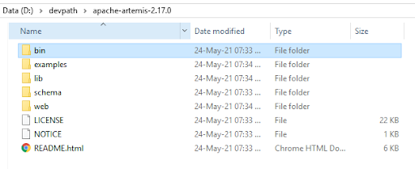
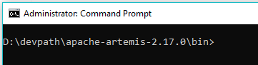
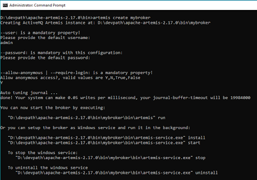
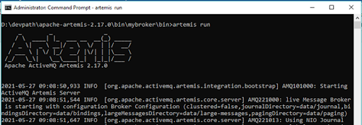
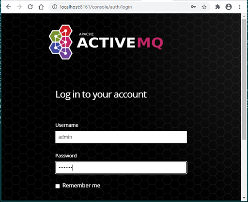
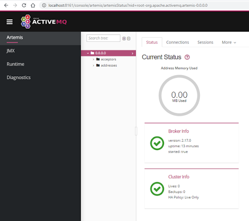

Setup ActiveMQ Artemis on Windows
Quickly learn how to set up ActiveMQ Artemis on your Windows OS machine. ActiveMQ Artemis is an open-source project for asynchronous messaging systems.
Ahsan Shah user avatar by Ahsan Shah · Updated Jul. 16, 21 · Tutorial
Like (6)
Comment (1)
Save
Tweet
18.6K Views
Join the DZone community and get the full member experience. JOIN FOR FREE
Overview
ActiveMQ Artemis is an open-source "next generation" broker from Apache with the performance and feature-set to implement high-performance messaging systems. Artemis is the code-name used for the HornetQ code that was donated to the Apache Foundation.

Pre-requisites:
Windows 7 or higher
Java 7 or higher
Let us start Artemis setup on Windows machine.

Step 1: Download and Extract the Archive
In this tutorial, Artemis version 2.17.0 is used for setup. You can download Zip file for the same using the below link:

https://www.apache.org/dyn/closer.cgi?filename=activemq/activemq-artemis/2.17.0/apache-artemis-2.17.0-bin.zip&action=download

Once downloaded, extract it to some convenient folder location, e.g.: D:\apache-artemis-2.17.0referred as ${ARTEMIS_HOME} in the tutorial.

Avoid having 'space' character in the folder name.

Download and Extract Archive

Step 2: Run the ActiveMQ Artemis
Open the command prompt and navigate to ${ARTEMIS_HOME}\bin

apache-artemis-2.17.0\bin

Create a Broker Instance using the command:

${ARTEMIS_HOME}\bin\artemis create mybroker

A broker instance is a directory containing all the configuration and runtime data, such as logs and data files.

Broker Instance Example

The above step will ask you to setup user credentials (username / password) as well. After creation, keep it safe as the same will be used for console login.

Now, start your newly created Broker Instance using the command:

${ARTEMIS_HOME}\bin\mybroker\bin\artemis run

Starting Broker Instance

Verify your Broker Instance by opening the console in the browser: http://localhost:8161/console

You will see the below login page.

ActiveMQ Login Page

Put the user credentials created during broker instance setup and login. You should be able to see the below console:

Artemis UI

That's It.
Now that the broker is running, you can optionally run some of the included examples to verify the broker is running properly.